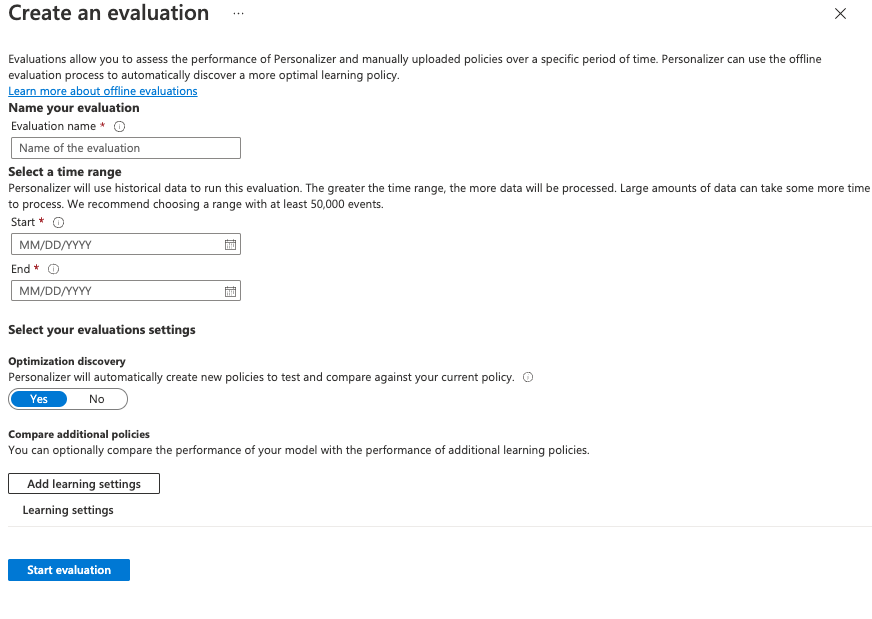

---
lab:
  title: 将 AI 个性化体验创建服务与 Visual Studio Code 笔记本配合使用以模拟循环
---
> **重要说明** 从 2023 年秋季起，无法再创建新的个性化体验创建服务资源。 只有你拥有现有的个性化体验创建服务资源，才使用此存储库进行引用。

在本练习中，你将在 Visual Studio Code 中将 Azure AI 个性化体验创建服务与笔记本配合使用来模拟学习循环。

## 使用 Azure 门户创建 Azure AI 个性化体验创建服务资源

1. 在 Azure 门户中，搜索“Azure AI 服务”****。 然后，在结果列表中的“个性化体验创建服务”下选择“创建”。********

   

1. 选择你的订阅，输入资源组名称和资源的名称。 对于定价层，请选择“免费 F0”。****
1. 选择“查看 + 创建”以查看所做的选择，然后选择“创建”以创建资源********。
1. 转到新建的 Azure AI 个性化体验创建服务资源，然后在“密钥和终结点”窗格中复制“密钥”和“终结点”并将其粘贴到某个安全的位置备用********：

   

1. 在导航窗格中选择“设置”，然后将“奖励等待时间”设置为 10 分钟（如果尚未设置），并将“模型更新频率”设置为 15 秒。****************
1. 选择“保存”。

## 设置笔记本

1. 在 Visual Studio Code 编辑器中，按 Ctrl+Shift+P**** 并选择“创建:**** 新 Jupyter 笔记本”。
1. 在你的设备上保存该文件并将其命名为 my-notebook****。
1. 现在需要安装所需的扩展。 在笔记本的右上方，选择“选择内核”。**** 然后，选择“安装/启用建议的扩展”。****

   

   > [!NOTE]
   > 如果你之前已执行此操作，则不会看到此选项，可以跳过此步骤。

1. 等待扩展完成安装，然后在出现的下拉列表中选择“Python 环境...”。****
1. 然后选择推荐的首选环境。

## 准备数据

在本练习中，我们将创建一个用户列表和一个咖啡产品列表，我们可以将这些列表用作 Azure AI 个性化体验创建服务的基础数据。

1. 将以下 JSON 代码复制到一个空文件中，并在你的笔记本文件所在的同一文件夹中将该文件保存为 `users.json`。

   ```json
   {
     "Alice": {
       "Sunny": {
         "Morning": "Cold brew",
         "Afternoon": "Iced mocha",
         "Evening": "Cold brew"
       },
       "Rainy": {
         "Morning": "Latte",
         "Afternoon": "Cappucino",
         "Evening": "Latte"
       },
       "Snowy": {
         "Morning": "Cappucino",
         "Afternoon": "Cappucino",
         "Evening": "Cappucino"
       }
     },
     "Bob": {
       "Sunny": {
         "Morning": "Cappucino",
         "Afternoon": "Iced mocha",
         "Evening": "Cold brew"
       },
       "Rainy": {
         "Morning": "Latte",
         "Afternoon": "Latte",
         "Evening": "Latte"
       },
       "Snowy": {
         "Morning": "Iced mocha",
         "Afternoon": "Iced mocha",
         "Evening": "Iced mocha"
       }
     },
     "Cathy": {
       "Sunny": {
         "Morning": "Latte",
         "Afternoon": "Cold brew",
         "Evening": "Cappucino"
       },
       "Rainy": {
         "Morning": "Cappucino",
         "Afternoon": "Latte",
         "Evening": "Iced mocha"
       },
       "Snowy": {
         "Morning": "Cold brew",
         "Afternoon": "Iced mocha",
         "Evening": "Cappucino"
       }
     },
     "Dave": {
       "Sunny": {
         "Morning": "Iced mocha",
         "Afternoon": "Iced mocha",
         "Evening": "Iced mocha"
       },
       "Rainy": {
         "Morning": "Latte",
         "Afternoon": "Latte",
         "Evening": "Latte"
       },
       "Snowy": {
         "Morning": "Cappucino",
         "Afternoon": "Cappucino",
         "Evening": "Cappucino"
       }
     }
   }
   ```

1. 接下来，复制以下代码并将其保存到名为 `coffee.json` 的文件：

   ```json
   [
     {
       "id": "Cappucino",
       "features": [
         {
           "type": "hot",
           "origin": "kenya",
           "organic": "yes",
           "roast": "dark"
         }
       ]
     },
     {
       "id": "Cold brew",
       "features": [
         {
           "type": "cold",
           "origin": "brazil",
           "organic": "yes",
           "roast": "light"
         }
       ]
     },
     {
       "id": "Iced mocha",
       "features": [
         {
           "type": "cold",
           "origin": "ethiopia",
           "organic": "no",
           "roast": "light"
         }
       ]
     },
     {
       "id": "Latte",
       "features": [
         {
           "type": "hot",
           "origin": "brazil",
           "organic": "no",
           "roast": "dark"
         }
       ]
     }
   ]
   ```

1. 将以下代码复制并粘贴到一个文件中，然后将该文件保存为 `example-rankrequest.json`：

   ```json
   {
     "contextFeatures": [],
     "actions": [],
     "excludedActions": [],
     "eventId": "",
     "deferActivation": false
   }
   ```

## 设置终结点和密钥

1. 在笔记本顶部，添加以下代码以包括所需的模块：

   ```python
   import json
   import matplotlib.pyplot as plt
   import random
   import requests
   import time
   import uuid
   import datetime
   ```

1. 选择单元格，然后选择单元格左侧的“运行”按钮：

   

   > [!NOTE]
   > 每次填充新单元格时，都务必选择“运行”按钮。 如果提示你安装 ipykernel 包，请选择“安装”。****

1. 选择笔记本顶部的“+ 代码”以创建新的代码单元格。**** 然后，添加以下代码：

   ```python
   # Replace 'personalization_base_url' and 'resource_key' with your valid endpoint values.
   personalization_base_url = "<your-endpoint>"
   resource_key = "<your-resource-key>"
   ```

1. 将 personalization_base_url**** 值替换为你复制的终结点，将 resource_key**** 值替换为你的密钥。

## 跟踪迭代

1. 接下来，创建代码来帮助记录你稍后将使用的迭代函数的开始和结束时间。 将以下代码添加到新单元格中：

   ```python
   # Print out current datetime
   def currentDateTime():
       currentDT = datetime.datetime.now()
       print (str(currentDT))

   # ititialize variable for model's last modified date
   modelLastModified = ""

   def get_last_updated(currentModifiedDate):

       print('-----checking model')

       # get model properties
       response = requests.get(personalization_model_properties_url, headers = headers, params = None)

       print(response)
       print(response.json())

       # get lastModifiedTime
       lastModifiedTime = json.dumps(response.json()["lastModifiedTime"])

       if (currentModifiedDate != lastModifiedTime):
           currentModifiedDate = lastModifiedTime
           print(f'-----model updated: {lastModifiedTime}')
   ```

1. 添加新代码后，不要忘记运行新单元格。

## 获取策略和服务配置

1. 接下来，你需要通过获取策略和服务配置来验证服务状态。 为此，请将下面的代码添加到一个新单元格：

   ```python
   def get_service_settings():

       print('-----checking service settings')

       # get learning policy
       response = requests.get(personalization_model_policy_url, headers = headers, params = None)

       print(response)
       print(response.json())

       # get service settings
       response = requests.get(personalization_service_configuration_url, headers = headers, params = None)

       print(response)
       print(response.json())
   ```

1. 请确保运行新的代码单元格。

该代码包含对服务 API 进行两次调用的函数。 当该函数被调用时，它将使用响应返回服务值。

## 设置用于调用的 URL 并读取 JSON 文件

现在，你将添加代码来执行以下操作：

- 构建 REST 调用中使用的 URL
- 使用个性化体验创建服务资源密钥设置安全性标头
- 设置排名事件 ID 的随机种子
- 读入 JSON 数据文件
- 调用 get_last_updated 方法 - 示例输出中已删除了学习策略
- 调用 get_service_settings 方法

1. 为此，请将以下代码添加到新的单元格，然后运行此代码：

   ```python
   # build URLs
   personalization_rank_url = personalization_base_url + "personalizer/v1.0/rank"
   personalization_reward_url = personalization_base_url + "personalizer/v1.0/events/" #add "{eventId}/reward"
   personalization_model_properties_url = personalization_base_url + "personalizer/v1.0/model/properties"
   personalization_model_policy_url = personalization_base_url + "personalizer/v1.0/configurations/policy"
   personalization_service_configuration_url = personalization_base_url + "personalizer/v1.0/configurations/service"

   headers = {'Ocp-Apim-Subscription-Key' : resource_key, 'Content-Type': 'application/json'}

   # context
   users = "users.json"

   # action features
   coffee = "coffee.json"

   # empty JSON for Rank request
   requestpath = "example-rankrequest.json"

   # initialize random
   random.seed(time.time())

   userpref = None
   rankactionsjsonobj = None
   actionfeaturesobj = None

   with open(users) as handle:
       userpref = json.loads(handle.read())

   with open(coffee) as handle:
       actionfeaturesobj = json.loads(handle.read())

   with open(requestpath) as handle:
       rankactionsjsonobj = json.loads(handle.read())

   get_last_updated(modelLastModified)
   get_service_settings()

   print(f'User count {len(userpref)}')
   print(f'Coffee count {len(actionfeaturesobj)}')
   ```

1. 该调用应当返回类似于以下示例的响应：

   ```bash
   -----checking model
   <Response [200]>
   {'creationTime': '2023-09-22T14:58:45+00:00', 'lastModifiedTime': '2023-09-22T14:58:45+00:00'}
   -----model updated: "2023-09-22T14:58:45+00:00"
   -----checking service settings
   <Response [200]>
   {'name': '917554355a3347a1af3d2935d521426a', 'arguments': '--cb_explore_adf --epsilon 0.20000000298023224 --power_t 0 -l 0.001 --cb_type mtr -q ::'}
   <Response [200]>
   {'rewardWaitTime': 'PT10M', 'defaultReward': 0.0, 'rewardAggregation': 'earliest', 'explorationPercentage': 0.2, 'modelExportFrequency': 'PT15S', 'logRetentionDays': 90, 'lastConfigurationEditDate': '2021-01-01T00:00:00', 'learningMode': 'Online'}
   User count 4
   Coffee count 4
   ```

1. 响应代码应为 `<Response [200]>`，指示调用成功。 rewardWaitTime 应显示为 10 分钟，modelExportFrequency 应为 15 秒。********

## 在 Azure 门户中设置图表

你的代码向 API 发出请求。 要想针对你的请求实现良好的指标，可以在 Azure 门户中创建指标图表：

1. 在 Azure 门户中，转到你的 Azure AI 个性化体验创建服务资源。

1. 在导航窗格中的“监视”下选择“指标”。****

   

1. 已为你设置了“范围”和“指标”命名空间。******** 你只需选择“成功的调用”作为指标，并选择“总和”作为聚合方法。****************

1. 将时间筛选器更改为过去四小时。

## 创建唯一的事件 ID

接下来，添加代码来为每个排名 API 调用生成唯一 ID。 你在请求中使用此 ID 来标识排名和奖励调用信息。

1. 为此，请在笔记本中创建一个新的代码单元格并添加以下内容：

   ```python
   def add_event_id(rankjsonobj):
       eventid = uuid.uuid4().hex
       rankjsonobj["eventId"] = eventid
       return eventid
   ```

1. 请确保运行新的代码单元格。

> [!NOTE]
> 在实际情景中，你将此项设置为购买行为的交易 ID 之类的东西。

## 获取用户、一天中的时间和天气

现在，你可以添加一个函数来执行以下操作：

- 选择唯一的用户、一天中的时间和天气组合。
- 将这些选定项添加到 JSON 对象，该对象将通过调用发送到排名 API。

为此，请将以下代码添加到新的单元格，然后运行此代码：

```python
def add_random_user_and_contextfeatures(namesoption, weatheropt, timeofdayopt, rankjsonobj):
    name = namesoption[random.randint(0,3)]
    weather = weatheropt[random.randint(0,2)]
    timeofday = timeofdayopt[random.randint(0,2)]
    rankjsonobj['contextFeatures'] = [{'timeofday': timeofday, 'weather': weather, 'name': name}]
    return [name, weather, timeofday]
```

## 添加咖啡数据

接下来，你将创建一个函数来将咖啡产品的完整列表收集到一个 JSON 对象中，该对象随后被发送到排名 API。

为此，请将以下代码添加到新的单元格，然后运行此代码：

```python
def add_action_features(rankjsonobj):
    rankjsonobj["actions"] = actionfeaturesobj
```

## 将预测结果与已知用户偏好进行比较

然后，可以创建一个函数来比较用户对特定咖啡的偏好，并考虑天气和一天中的时间等详细信息，以及 Azure AI 个性化体验创建服务的建议。

1. 为此，请创建一个新的单元格，添加以下代码并运行此代码：

   ```python
   def get_reward_from_simulated_data(name, weather, timeofday, prediction):
       if(userpref[name][weather][timeofday] == str(prediction)):
           return 1
       return 0
   ```

1. 每次调用排名 API 时，此函数都会运行。 如果建议匹配，则会在响应中返回分数 `1`。 如果不匹配，则将返回 `0`。

## 创建包含对排名和奖励 API 的调用的循环

前面的单元格用于为循环设置笔记本。 现在，你将配置循环。 循环涵盖了你的笔记本中的工作的主体。 它获取一个随机用户，获取咖啡列表，并将它们都发送到排名 API。 它将来自 Azure AI 个性化体验创建服务的预测与该用户的已知偏好进行比较，然后再次将奖励发送回 Azure AI 个性化体验创建服务。

若要创建循环，请将以下代码添加到新单元格并运行它：

```python
def iterations(n, modelCheck, jsonFormat):

    i = 1

    # default reward value - assumes failed prediction
    reward = 0

    # Print out dateTime
    currentDateTime()

    # collect results to aggregate in graph
    total = 0
    rewards = []
    count = []

    # default list of user, weather, time of day
    namesopt = ['Alice', 'Bob', 'Cathy', 'Dave']
    weatheropt = ['Sunny', 'Rainy', 'Snowy']
    timeofdayopt = ['Morning', 'Afternoon', 'Evening']


    while(i <= n):

        # create unique id to associate with an event
        eventid = add_event_id(jsonFormat)

        # generate a random sample
        [name, weather, timeofday] = add_random_user_and_contextfeatures(namesopt, weatheropt, timeofdayopt, jsonFormat)

        # add action features to rank
        add_action_features(jsonFormat)

        # show JSON to send to Rank
        print('To: ', jsonFormat)

        # choose an action - get prediction from Personalizer
        response = requests.post(personalization_rank_url, headers = headers, params = None, json = jsonFormat)

        # show Rank prediction
        print ('From: ',response.json())

        # compare personalization service recommendation with the simulated data to generate a reward value
        prediction = json.dumps(response.json()["rewardActionId"]).replace('"','')
        reward = get_reward_from_simulated_data(name, weather, timeofday, prediction)*10

        # show result for iteration
        print(f'   {i} {currentDateTime()} {name} {weather} {timeofday} {prediction} {reward}')

        # send the reward to the service
        response = requests.post(personalization_reward_url + eventid + "/reward", headers = headers, params= None, json = { "value" : reward })

        # for every N rank requests, compute total correct  total
        total =  total + reward

        # every N iteration, get last updated model date and time
        if(i % modelCheck == 0):

            print("**** 10% of loop found")

            get_last_updated(modelLastModified)

        # aggregate so chart is easier to read
        if(i % 10 == 0):
            rewards.append( total)
            count.append(i)
            total = 0

        i = i + 1

    # Print out dateTime
    currentDateTime()

    return [count, rewards]
```

下面是函数发送到排名 API 的 JSON 结构的示例：

```python
{
    'contextFeatures':[
      {
          'timeofday':'Evening',
          'weather':'Snowy',
          'name':'Alice'
      }
    ],
    'actions':[
      {
          'id':'Cappucino',
          'features':[
            {
                'type':'hot',
                'origin':'kenya',
                'organic':'yes',
                'roast':'dark'
            }
          ]
      }
        ...rest of the coffee list
    ],
    'excludedActions':[

    ],
    'eventId':'b5c4ef3e8c434f358382b04be8963f62',
    'deferActivation':False
}
```

排名 API 将使用如下所示的内容进行响应：

```python
{
    'ranking': [
        {'id': 'Latte', 'probability': 0.85 },
        {'id': 'Iced mocha', 'probability': 0.05 },
        {'id': 'Cappucino', 'probability': 0.05 },
        {'id': 'Cold brew', 'probability': 0.05 }
    ],
    'eventId': '5001bcfe3bb542a1a238e6d18d57f2d2',
    'rewardActionId': 'Latte'
}
```

每个循环迭代将显示随机选择的用户、天气和一天的时间，以及正确确定的奖励：

```bash
1 Alice Rainy Morning Latte 1
```

奖励为 `1` 意味着 Azure AI 个性化体验创建服务资源已针对用户、天气和一天中的时间这一特定组合选择了正确的咖啡类型。

## 运行循环并查看图表结果

Azure AI 个性化体验创建服务需要调用排名 API 和奖励 API 几千次才能创建一个模型。 你将为一组迭代运行循环。

1. 为此，请创建一个新的代码单元格，添加以下代码并运行此代码：

   ```python
   # max iterations
   num_requests = 150

   # check last mod date N% of time - currently 10%
   lastModCheck = int(num_requests * .10)

   jsonTemplate = rankactionsjsonobj

   # main iterations
   [count, rewards] = iterations(num_requests, lastModCheck, jsonTemplate)
   ```

1. 定期刷新 Azure 门户中的指标图表，以查看调用服务的总次数。
1. 此事件可能会运行一段时间。 在笔记本完成之前不要关闭笔记本。 当循环进行大约 20,000 次调用时（循环的每次迭代都会进行排名和奖励调用），循环将结束。

1. 接下来，在笔记本中创建一个图表来绘制排名事件的批次，以及针对每个批次提出了多少条正确的建议。 为此，请将以下代码添加到一个新单元格，然后运行此代码：

   ```python
   def createChart(x, y):
       plt.plot(x, y)
       plt.xlabel("Batch of rank events")
       plt.ylabel("Correct recommendations per batch")
       plt.show()

   createChart(count,rewards)
   ```

1. 你的笔记本将创建一个图表：

   

> **
          **提示：理想情况下，在测试完成后，你的循环平均应当以 100% 减去探索值（默认为 20%）后得到的比率提出正确的建议，所以 80% 是你的目标比率。 实现此目标的一种方法是将迭代此次增加到至少 10,000 次。

该图表显示了你的模型基于默认学习策略时的成功程度。 此图表表明学习策略可以改进。 可以通过在运行评估后更改策略来执行此操作。

## 运行脱机评估

> [!NOTE]
> 本练习的此部分是可选的，因为它只能在对 Azure AI 个性化体验创建服务资源进行至少 50,000 次调用后才能执行。 但是，当你在某个时候达到了对资源进行了 50,000 次调用这个条件时，可以返回到此部分。

你可以运行脱机评估，通过进行至少 50,000 次调用来为 Azure AI 个性化体验创建服务资源找到更好的学习策略。

1. 在 Azure 门户中，转到 Azure AI 个性化体验创建服务资源的“优化”窗格，然后选择“创建评估”。****
1. 提供一个评估名称，并为循环评估选择开始和结束日期范围。 该日期范围应当仅包括你要重点评估的日期：

   

1. 选择“开始评估”以开始你的评估。****

1. 在评估完成后，从“优化”窗格中的评估列表中选择它。 然后，根据平均奖励、置信区间等详细信息来检查学习策略的性能：

   

1. 你会看到几个策略，包括：

   - Online - Azure AI 个性化体验创建服务的当前策略****。
   - Baseline1 - 应用的基线策略****
   - BaselineRand - 随机执行操作的策略****。
   - Inter-len# 或 Hyper# - 优化发现创建的策略********。

1. 选择对模型改进程度最大的策略来进行“应用”****。

## 清理资源

如果不将本实验室创建的 Azure 资源用于其他培训模块，则可以删除这些资源以避免产生更多费用。

1. 打开 Azure 门户网站 `https://portal.azure.com`，在顶部搜索栏中搜索在本实验室中创建的资源。

2. 在资源页面上，选择**删除**，然后按照说明删除资源。 或者，也可以删除整个资源组，同时清理所有资源。
